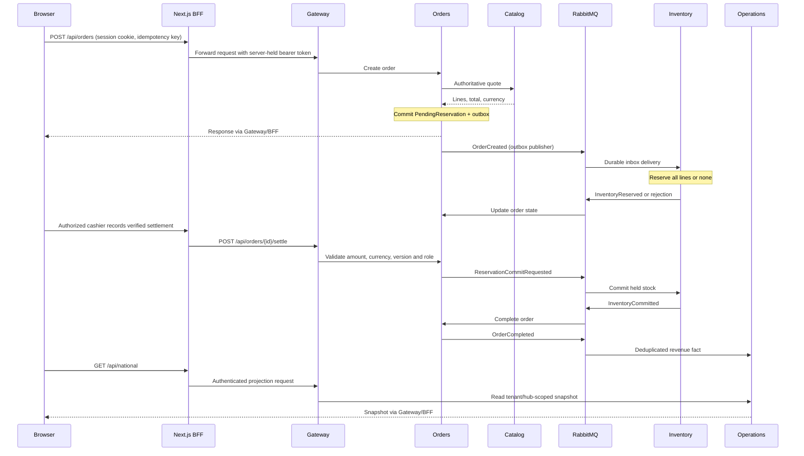

# Nationwide architecture and delivery boundaries

## Topology

The diagram below represents the enterprise foundation. Azure edge/ingress and cloud hosting are proposed deployment components, not currently provisioned services. The existing static storefront/member/owner demos and Node/SQLite staff application sit outside this topology and do not share its databases.

```text
Customers / staff / corporate console
        |
   TLS ingress / Azure edge WAF
        |
   Next.js BFF ----- OIDC provider (SSO / MFA / provisioning)
        |                  |
   encrypted session    signed tenant / roles / hubs
   records in Redis
        |
   REST / bounded GraphQL gateway
        |
        +--- Hubs -------- PostgreSQL: hubs
        +--- Catalog ----- PostgreSQL: catalog
        +--- Inventory --- PostgreSQL: inventory
        +--- Orders ------ PostgreSQL: orders
        +--- Operations -- PostgreSQL: projections
                       |
              transactional outbox/inbox
                       |
                RabbitMQ topic exchange
                       |
          future independent bounded contexts
```

Service-owned databases/users prevent cross-domain writes. The local stack shares one PostgreSQL server for convenience, but not database credentials. Cloud deployment can independently isolate/scale servers, retain a managed RabbitMQ cluster and managed Redis. No service reads another service's tables. Request-specific quotes are synchronous; lifecycle propagation is asynchronous.

### Diagram description

Read the diagram from top to bottom:

1. **Users and edge:** customers, employees and corporate users enter the Next.js console through TLS ingress. A future Azure edge/WAF layer protects public traffic. The default production template exposes the web application, not the domain services or metrics.
2. **Identity boundary:** the browser redirects to an external OIDC provider for sign-in. The Next.js backend completes authorization code + PKCE with state/nonce verification. Authentication, SSO and MFA configuration belong to the provider; this repository does not implement a password database for enterprise users.
3. **Session boundary:** the browser receives an encrypted HTTP-only cookie holding an opaque session ID. Access/refresh tokens are encrypted in Redis. The BFF retrieves/refreshes them server-side and forwards the access token; it never returns bearer tokens to browser JavaScript.
4. **API boundary:** Gateway forwards only declared REST routes and exposes a limited `national` GraphQL query. Gateway and domain services validate JWT issuer/audience, and domain authorization derives tenant, responsibility-based roles and assigned hubs from trusted claims.
5. **Domain boundary:** Hubs owns facilities; Catalog owns product/pricing/quotes; Inventory owns balances/holds; Orders owns the merchandise lifecycle; Operations owns read projections. Each has its own PostgreSQL database/user. The only synchronous business dependency shown is Orders requesting an authoritative Catalog quote.
6. **Messaging boundary:** writes and outgoing events commit together through a transactional outbox. RabbitMQ routes events to durable domain queues. Consumers persist to inboxes before acknowledging deliveries, then commit handler changes and processed state together. Events are at least once, not magically exactly once.
7. **Read-model boundary:** Operations incrementally aggregates hub inventory and completed merchandise sales. The dashboard is eventually consistent and shows timestamps. A command response does not imply every projection has already updated.
8. **Future contexts:** service work, queues, bookings, workforce, procurement, finance, notifications, reports and trained AI are planned event/API consumers, not active implementations in this diagram.

**Arrow semantics:** vertical/browser/API connections are HTTP request/response; the OIDC connection includes browser redirects and server-side token/discovery calls; Redis/PostgreSQL connections are server-side persistence; outbox/broker/inbox paths are asynchronous event delivery. All domain paths retain tenant identity. Production TLS/private networking requirements are described in the [operations runbook](OPERATIONS.md).

### Order sequence diagram



This diagram shows the successful path. Rejection, cancellation, expiry and paid-but-uncommitted reconciliation states are described below. No payment provider is contacted by the settlement endpoint.

## All 18 bounded contexts

| Domain | Status in this delivery | Ownership / next contract |
|---|---|---|
| 1. Identity/access | External OIDC integration | Provider owns credentials, sessions, SSO/MFA. Apps consume validated claims. Production federation/enrollment are operator configuration. |
| 2. Hub management | Implemented registry/status | Facility UUID, location, type, region, bays; emits `HubRegistered`. Detailed hours/capacity/staff roster still future. |
| 3. Inventory | Implemented merchandise slice | On-hand/reserved/quarantine balances, receiving, ledger, holds/expiry; emits `InventoryUpdated`. Transfers, returns, auditing/adjustments and forecasts are future. |
| 4. Inventory locator | Implemented Inventory read API | Tenant-wide availability, scoped hub positions. Travel-distance nearest branch, incoming ETA and transfers are future. Separate deployment when traffic justifies it. |
| 5. Product catalog | Implemented master/pricing/quote | Products, SKU uniqueness, physical type, base cost/price, per-hub price. Images, fitment, promotions and bulk search are future. |
| 6. Sales/POS | Implemented merchandise saga | Canonical quote, order ownership, cancellation, externally verified settlement and completed sale. Tax, refunds, offline synchronization and reconciliation closeout are future. |
| 7. Service management | Planned | Vehicle inspections, repair/work orders, parts demand; consumes committed parts events; owns repair lifecycle. |
| 8. Queue management | Planned | Per-hub sequence/priority/wait state and customer display; service lifecycle events. |
| 9. Booking/scheduling | Planned | Appointment/time-window/resource/bay allocation; emits `ServiceBooked`. Enforce no overlapping allocations transactionally. |
| 10. Workforce/attendance | Planned | Shifts, geofencing policy, biometric adapter, leave/time records; emits `AttendanceRecorded`. |
| 11. Customer management | Planned | Customer/vehicle ownership, consent, loyalty and membership. Subject linkage exists, not full CRM. |
| 12. Kiosk ordering | Planned | Restricted channel adapter to sales/booking/payment APIs; short-lived QR sessions. Never bypass domain authorization. |
| 13. Procurement | Planned | Suppliers, PO approval, delivery acceptance and replenishment; emits `PurchaseOrderReceived`. |
| 14. Financial | Planned | Double-entry posting, expense/commission rules, reconciliation and hub profit. Current merchandise revenue is not a ledger or net profit. |
| 15. Business intelligence | Implemented limited Operations projection | Incremental per-hub stock counts and currency-separated completed merchandise revenue. Other facts, historical trends and general BI warehouse are future. |
| 16. AI insights | Planned | Governed model/feature/inference service; validated demand forecasts with confidence/backtesting. Current low-stock messages are deterministic rules, not AI. |
| 17. Notifications | Planned | Consent, templates, provider adapters, outbox/retries/channel outcomes; appointments/service/inventory events. |
| 18. Reporting | Planned | Async immutable report jobs, object storage, export authorization and download expiry; PDF/XLSX/CSV. |

Legacy Hub Administration already demonstrates many operational workflows, but it is **not automatically transformed into these services**. Its SQLite records and browser demos are separate sources. Migration needs tenant mapping, data quality checks, IDs, reconciliation and consent, not direct database copying.

## Merchandise saga

1. Orders fetches the authoritative Catalog quote inside the command's idempotency transaction. A replay returns the durable response without contacting Catalog.
2. `OrderCreated` plus order state commits in Orders' database.
3. Inventory consumes it after durable inbox acceptance, locking the reservation and product positions in deterministic product order.
4. All requested stock is held or the entire reservation is rejected. SQL constraints and optimistic versions prevent overselling.
5. Orders accepts `InventoryReserved` and becomes `AwaitingSettlement`.
6. An authorized cashier records a verified external settlement and atomically emits `ReservationCommitRequested`.
7. Inventory deducts held stock and publishes `InventoryCommitted`. Repeated commit requests acknowledge the existing commitment without another deduction.
8. Orders becomes `Completed`, timestamps it and publishes `OrderCompleted`.
9. Operations inserts a unique order fact before accumulating revenue; duplicates with different event IDs cannot double-count a sale.

Failure states are explicit. Pending reservation times out after five minutes; holds expire after fifteen. A release arriving before creation leaves a tombstone so reordered messages cannot recreate a hold. A paid order whose hold expires is reconciliation-required. This code does not charge or automatically refund payments.

## Event contracts

`DomainEvent` includes ID, type, schema version, tenant, optional hub, aggregate ID/version, UTC occurrence time, trace reference and JSON object data. The current schema is `1`; unsupported envelopes are rejected to the service's durable poison queue. The topic exchange is `drivecore.events.v1`.

| Publisher | Events | Consumers |
|---|---|---|
| Hubs | `HubRegistered` (also status updates) | Catalog, Inventory, Operations |
| Catalog | `ProductUpdated` | Inventory |
| Orders | `OrderCreated`, `ReservationCommitRequested`, `ReservationReleaseRequested` | Inventory |
| Inventory | `InventoryReserved`, `InventoryReservationRejected`, `InventoryCommitted`, `InventoryCommitRejected`, `InventoryReservationReleased` | Orders |
| Inventory | `InventoryUpdated` | Operations |
| Orders | `OrderCompleted`, `OrderReconciliationRequired` | Operations |

Topology is declared centrally by each transport connection so the first publisher cannot outrun subscriber queue creation. Event and poison queues are durable quorum queues. Production broker permissions must allow these declarations, or operators must preprovision the identical topology before tightening ACLs. Publishing is serialized on the shared publisher-confirm channel. Broker automatic recovery and the application reconnect loop both preserve durable queue semantics.

Outbox publication is at least once, with persistent messages, mandatory routing and publisher confirms. A transaction holds the outbox row until publication succeeds. The consumer persists the envelope into an inbox with a unique ID **before ACK**. Domain mutations and processed state commit together. Duplicate IDs are ignored. Failed handlers back off to a maximum five-minute delay and stop after ten attempts. Failed rows and raw poison messages remain inspectable; nothing is called successful when it was not applied.

Stock mirrors use source versions to ignore stale events. Revenue deduplication also keys on tenant/order fact ID. Cross-domain reads are **eventually consistent**; the console shows projection generation/last-event times. Command responses are authoritative for the writing domain, not proof that all projections have caught up.

## Data and tenant policy

- All aggregate/stock/ledger/fact queries carry tenant keys. Idempotency includes tenant, subject and UUID key; different body reuse fails. Assigned-hub/customer scope is applied before pagination.
- Tenant/hub attributes must be administrator-issued and non-self-editable in the identity provider. A signed claim is not safe if an end user can choose it.
- Roles are responsibility-based, not unrestricted hierarchical inheritance. Corporate privileges are explicit.
- Currency amounts are integer minor units. This slice permits PHP/GBP and rejects mixed-currency orders. The national projection never adds different currencies.
- UTC defines daily/week/month/year revenue periods; regional business-day accounting is a future financial policy.
- Customer tokens see public product information, not internal supplier cost.
- Audit tables hold subject/action/target/hub and timestamps. They are not yet tamper-evident, immutable external archives.
- PostgreSQL RLS/tenant-specific database placement are optional future defense-in-depth; they are not advertised as already enforced.

## Scaling and resilience design

Deploy stateless services across availability zones; HPA, resource requests/limits, disruption budgets and rolling updates are generated. Redis coordinates web sessions and refresh rotation. PostgreSQL serializes conflicting writes; RabbitMQ isolates domain processing. Incremental `hub_scores` and `daily_revenue` avoid reading millions of stock rows for every national dashboard request.

**Known baseline limits:** per-tenant/service event serialization, one outbox dispatch and inbox handler per pump tick (~500ms polling), an in-process gateway rate limiter, offset pagination, unpartitioned tables and retained idempotency/inbox/outbox history. These are correctness-oriented foundations, **not** evidence of high-throughput capability.

Before 10,000-user/large-transaction operation, benchmark and then:

- Process partitioned aggregate keys (e.g. tenant/hub/order) without dropping deterministic stock locks.
- Drain bounded outbox/inbox batches per tick, tune prefetch/pooling and preserve same-aggregate order.
- Add keyset pagination and appropriate tenant/hub JSONB/expression indexes.
- Partition/archive stock ledger, inbox/outbox/audit/idempotency records under a defined replay/retention policy; do not expire replay keys earlier than retry windows.
- Apply distributed ingress/API quotas and isolate customer, kiosk and staff workloads.
- Replicate/backup stateful dependencies with tested failover; use object storage for assets/reports and a search index for catalogue scale.
- Introduce event-fed analytical storage for long-lived trends, financial facts and AI features.

## Proposed availability and disaster recovery gates

Goals, not measured guarantees: 99.9% monthly customer/API availability (43.2 minutes of error budget per 30 days), same-region multi-zone failover, warm secondary-region recovery with RPO <=5 minutes and RTO <=60 minutes. Achieving these depends on database/broker replication, backups, identity/Redis design, DNS, incident staffing and successful drills.

Use a single write region initially. Global multi-writer stock or active-active order placement is not safe merely by adding replicas. Establish per-hub write ownership and tested conflict/failover policy before multi-region inventory writers.

Trace and metric instrumentation exists; local OTLP exports to a diagnostic collector and Prometheus scrapes service metrics. Production requires an Azure Monitor/managed Prometheus/Grafana pipeline, log redaction/retention, correlation propagation, event-lag/failure/stock-invariant dashboards and alert routing. Trace references exist in envelopes, but full cross-service trace parenting is future work.
